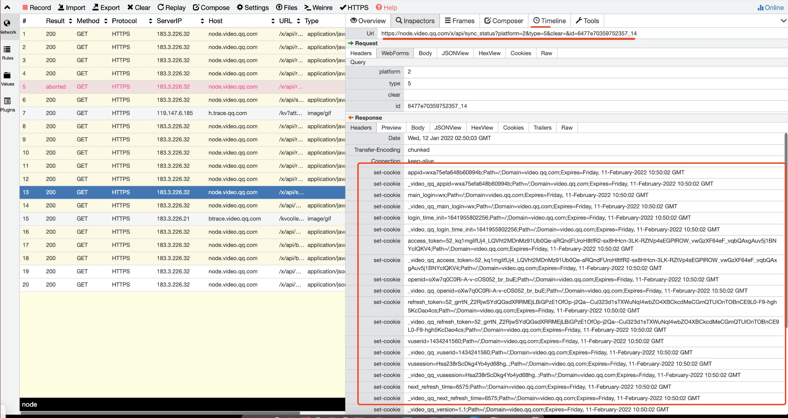

# 一、概述


登陆组件包含在腾讯视频 web 端的核心库 txv.core.js 中，其中封装了登录组件、所有视频相关 web 共同复用的 ui 交互逻辑、上报逻辑。各种回调函数嵌套，非常恶心；

重点在于登录，其余都是些耦合的屎山。接下来围绕重点剖析一下整体的视频 web 登录方案。

整个腾讯视频的 web 登录主要围绕着 cookie 存放用户信息去实现，核心在于接入层域名 video.qq.com 和业务侧域 v.qq.com 下的 cookie 间的通信。
  

# 二、用户登录鉴权流程

  

1. 用户打开登录框，内嵌一个 iframe，拉起 qq/wx 提供的 web 互联登录页面。这个页面 url 会拼上一些参数，用于扫码或密码登陆成功后执行一些操作。

	如下地址，拉起 web 登录框会拼接并插入这个 iframe 到页面上 https://graph.qq.com/oauth2.0/show?redirect_uri=https%3A%2F%2Fvideo.qq.com%2Ftransfer_login_page%2Findex.html%3Fvplatform%3D2%26type%3Dqq%26appid%3D101483052&which=Login&display=pc&response_type=code&client_id=101483052 
	
	redirect_url，是互联平台登陆成功后重定向的地址，利用这种方式就可以在 redirect_url 中向我们腾讯视频自己的鉴权服务发起请求，获取票据和身份信息了。
  
2. 扫码或密码登陆成功，互联平台会往 redirect_url 后面拼接一个 query：appid=101483052&code=DF3C376085A09FE85EA864FD90860415
	
	code 是 qq/wx 侧登陆成功后下发的唯一标识，appid 是视频注册的唯一平台 id。
	
	登陆组件再拼接对应的平台好，登陆类型 type=qq 给登录中转页。此时 iframe 就会根据 redirect_url 去从定向到我们自己写好的中转页。redirect_uri: [https://video.qq.com/transfer_login_page/index.html?vplatform=2&type=qq&appid=101483052&code=DF3C376085A09FE85EA864FD90860415](https://video.qq.com/transfer_login_page/index.html?vplatform=2&type=qq&appid=101483052&code=DF3C376085A09FE85EA864FD90860415)


3. 在登录中转页 transfer_login_page 中，页面加载完成立刻拿着 query 参数向视频登录后台发起请求，视频鉴权后台向 qq/wx 侧验证 code 有效则通过，下发用户票据 vusession 和 next_refresh_time 下一次续期时间间隔、用户头像等信息。
	
	同时后台接口会将这些信息 set-cookie 设置到 video.qq.com 域下，回包 data 也会下发同样的字段信息 <font color="red">(实际上有点多余，但有些历史项目需要接口直接 set-cookie)</font>
  
  
  
4. 中转页拿到用户信息、票据，通过 postMessage 通知业务方，业务方通过引入 txv.core.js 中的 postMessage 来接收票据并注入到业务方自己的域名下；

	保证 video.qq.com 域下的票据和业务方v.qq.com 域下的票据一致。这样业务侧自己取 cookie 中的登录态信息、其他后台走统一接入层 pbaccess.video.qq.com 的服务请求携带的 cookie 完全一致，不会出错。
	
5. qq/wx 登陆及视频鉴权完成，txv.core.js 执行业务侧主动注册的 addLoginCallback（登录态 ready）事件，流程结束。

6. 续期，切换页面可见主动续期（十分钟冷却）、根据 next_refresh_time 设置一个定时器，这个值每次调用登录或者续期接口时都会更新，单位 s，保证在下次某个时间点前一定发起续期。

7. 登出，调 logout 接口，接口会清理 video.qq.com 下的 cookie 中的登录信息，txv.core.js 会清理业务侧 v.qq.com 域下的登录信息。
 
  

# 三、小程序码登录（已下线，但方案设计还不错，总结为自己的）

  
> **背景：** 微信不提供公用的小程序码登录，但为了给小程序拉量，产品希望扫码登录优先走小程序，在小程序侧点击登陆后，通知到 web 端，实现小程序和 web 共同登录。


**1.  整体架构**
  
  
  
  
注意：整个流程都围绕着登录状态status的变更：
```
const REQ_INIT = 1 // 码成功生成 
const REQ_SCAN_SUCC = 2 //扫码成功 
const REQ_CANCEL_LOGIN = 3 //取消登陆 
const REQ_CONFIRM_LOGIN = 4 //确认登陆 
const REQ_REMOVE_STATUS = 5 //删除登录状态
```

  
**2、先描述一下结构图中各个构成部分的主要功能**

>这部分的各个结构的功能解析可能直接看起来会抽象些，可能直接看不太好理解，建议可以先看 # 3. 登录完整流程解析

**登录组件内嵌的微信登录页面**

https://cache.tv.qq.com/miniapp/wxlogin/index.html?platform=2 这个页面会被内嵌到 web 端登录组件还有mac/pc 客户端的登录组件中。主要功能是：

a. 与 socket 中台建立链接，（socket 失败会用 http 轮询兜底）获取最新登录状态或 key 值
b. 与node中转后台通信
c. 生成小程序二维码 status=1 写入到 redis
d. 轮询触发 node 中台种植 cookie 到客户端、删除 redis 存储的登录状态操作 status=5
e. 轮询读 redis, key 被清理的的话二维码就失效了

**Websocket 服务中台**
根据 node 中转后台触发的 push，推送最新的 status 等信息给登陆组件侧更新状态  https://git.woa.com/tencentvideo_node/txv.alive

**Node 中转后台**
a. 接收 wx 登录页面（status 1）和小程序端（status 2，status 3， status 4）同步来的状态。
b. 读写 redis 服务来查询或存储当前 key 对应的状态或登录状态信息；
c. 主动触发 push 操作通知 socket 中台向 web 端推送最新状态;
d. 最后向浏览器端种植 cookies 时，拼接 set-cookie http 头并返回给浏览器。

- **写服务(/sync_status)：** 一是提供临时状态存储，将二维码生成成功、扫码成功、确认登录、取消登录这些状态写入 redis，确认登录时，状态和登录态一并写入，并设置过期时间，过期自动清理；二是通知 websocket 服务当前写入的状态，websocket 服务在通知页面更新 UI 状态  

- **读服务 (/read_status)：** 主要是供页面轮询当前状态，以显示相应 UI，作为一个兜底

**Redis 端**
同一个 redis 服务提供读写两个接口，供 node 中台读取和存储登录流程状态和登录态信息等，小程序码生命周期内，这个 redis 存的 key 有效期为5分钟。

因为登录特殊，为防止意外，在写入状态时，进行了双写，以视频侧 redis 为主，腾讯云 redis 为辅（反过来亦可），当读取视频侧 redis 失败时，去读取腾讯云 redis。

**小程序端**
微信扫码后拉起，拉起后读取到二维码链接上带来的唯一 key。
通知 node 中转后台扫码成功、取消登录、确认登录这几个状态变更。
当用户点击确认登录时和后台交互获取当前微信账号在腾讯视频的登陆态信息。

**后台登录服务**
根据小程序传来的 wx 账号信息，换算得到该账号在腾讯视频登录环境下的登陆态信息，返回给小程序端。


**3、小程序登录完整流程解析**

>接下来以一次完整的登录流程为例，讲述 wx 小程序登录流程到底按步骤依次经历了哪些过程：

1. 首先登录组件的内嵌 wx 登录页面，会向 websocket 中台服务请求建立 socket 连接，socket 连接建立后，socket 中台会向 wx 登录页面推送一个唯一标志当前连接的 key，这个 key 很重要，之后整个 wx 小程序登录流程都会围绕着这个 key 作为追溯等的唯一标记。***一个 key 对应一个小程序码。***

2. 登录组件拿到唯一key后会带上平台号等信息 拼接一个链接，形如：
	https://m.v.qq.com/author_login_tinyapp.html?appname=tinyapp&page=login%2Fwx%2Fwx&scene=bdd7ae425329dd8e_18 
	
	再通过第三方组件用这个链接生成小程序的二维码。

3. 二维码生成成功后，登录组件会将二维码已经生成的状态 status=1 同步给 node 中转后台。

4. Node 中转后台收到来自登陆组件 status 变更为 1 的通知后，会将该状态存储到 redis。

5. 当用户使用 wx 进行扫码，将会拉起小程序，小程序就拿到链接信息里面有 key 和平台信息等；小程序扫码成功后会主动向 node 中台发送请求，通知 node 中转后台当前已经扫码成功 status 状态变为2；

6. Node 中转后台此时会根据 key 从 redis 中读取当前 redis 中存储的状态，这里有两种情况：
	**核心逻辑，先读 redis 中的 status，校验无误后再更新 redis 中的 status** 

	- 如果读到 redis 存储的 status=1, 那就认为此时的扫码成功是有效的，将会重新将用 key 作为键把 status=2 存储在 redis 中，并触发 websocket 的 push 能力，将扫码成功这个状态变更通知到登录组件，登录组件的展示就会变更，提示扫码成功。
	  
	   
	- 如果读到 redis 存储的 status 大于或等于 2, 那就说明这个二维码已经被别人扫过并走到后面的状态了。此时就不再往 redis 中更新状态了。

7. 用户扫码后小程序上将会有两个按钮：确认登录和取消登录；

8. 如果用户点击了取消登录，小程序会将取消登录的状态 status=3 发送 http 请求传递给 node 中转后台，中转后台也会读取一下当前 key 最新 redis 的状态，看这个状态变更是否有效，有效就更新到最新 redis，并触发 socket push 能力，将状态同步到前端；之后用户又可以重新扫码开始新一轮的验证流程。

9. 如果用户在小程序点击了确认登录，此时小程序会和腾讯视频登录后台进行通信，用微信登录票据换取该账号对应腾讯视频的登陆态信息。再将登陆态信息同步到 node 中台同时 status=4，此时小程序的使命就算完成了。

10. 接下来 node 中台会将登录态信息存储在 redis 中，存储的登陆态信息是这样的。(还包含小程序请求到的 vusession、vuserid、access_token 等登录票据)
	```
	{\"errcode\": 0,\"errmsg\":\"\",\"status\": 4,\"extraData\":{\"next_refresh_time\":\"6600\",\"nick\":\"陶明灯\",\"head\":\"https://thirdwx.qlogo.cn/mmopen/vi_32/Q0j4TwGTfTI7JkiaAQPeXbRdQhcy91qZQa8h9EVF0TIUAqCKsNFaPwic0wvUesLY0ibCmjhIXTjNibF8LYbPVnh0zg/132\" ...}}
	```
	ExtraData 中的就是后面要种植在页面中的 cookie 键值对。同时 node 中台会触发 socket push 将 wx 小程序扫码成功 status=4 通知到登录组件端。

11. 登录组件知道当前小程序已经授权登录成功后，会主动往 node 中转后台发起 http 请求（sync_status），带的状态 status=5，目的是删除前面流程中存储的 status 状态，还有一个最最重要的目的，触发后续流程中 cookie 的种植。

12. Node 中转后台接受到来自登录组件 status=5 的请求后，会去触发单独写 redis 的操作，将之前这个 key 的 redis 存储信息删除。
	但在这之前最最重要的操作是，它会先读取当前 key 在 redis 前面存储的信息，正常情况下前一个状态是 4 ，这时 redis 里面存储着小程序侧传递过来的登陆态相关信息，
	node 中台将这些信息读取出来，根据里面的 cookie 过期时间键值对信息等，拼接生成 set-cookie 的 http 头信息返回到客户端，这样 cookie 信息就被种植到浏览器的 video.qq.com 下了。 
	
	
	到此微信小程序登录的全部流程就结束了。

|      |                                       |                                             |                                              |
| ---- | ------------------------------------- | ------------------------------------------- | -------------------------------------------- |
| 代码仓库 | 生成小程序码的内嵌 iframe 页面：**miniapp_login** | Node 中转层：**http-cgi 1221(/sync_status 接口)** | Node 中转层：**http-cgi 1222 (/read_status 接口)** |

# 四、Q&A

1. cookie安全性问题，cookie被截取了怎么办，
2. 为什么这个方案而不选用oAuth
3. cookie放在两个域下的必要性？
4. reids相关问题，
5. websocket 如何接收并转发 node 中台的消息给 web
  

  

