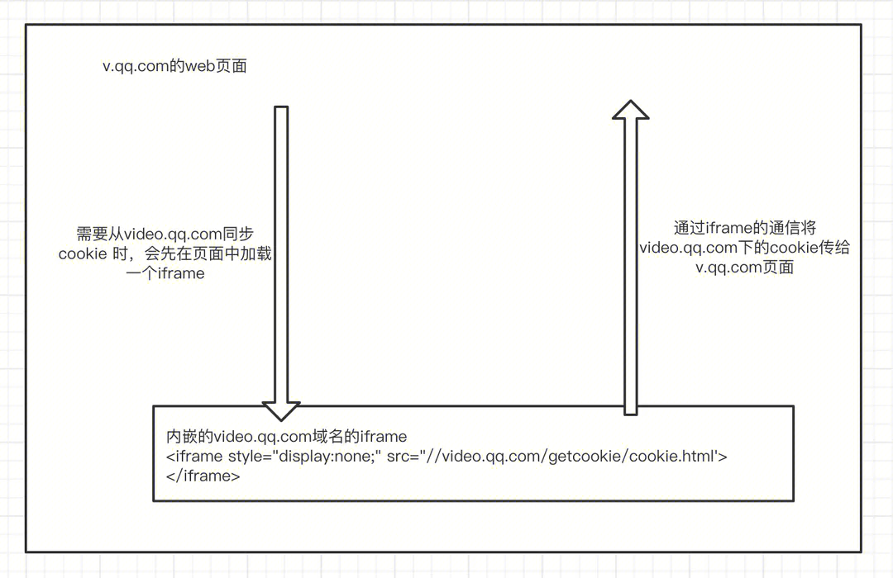

# 一、痛点

腾讯视频基于 web 技术栈的登录，在多个不同的终端和环境应用，基本流程和逻辑一致（登录、续期、退出登录），但是却各自实现，技术栈不同、分散在不同的代码仓库，维护困难。

# 二、目标

统一多端的登录能力，统一 api 降低业务方理解成本，在同一项目开发，支持编译部署到不同的终端。

# 三、各端登录情况概览

| 终端类型        | 维护同学      | 项目地址                                                                                  | 技术栈               | 情况描述                                                                              |     |
| ----------- | --------- | ------------------------------------------------------------------------------------- | ----------------- | --------------------------------------------------------------------------------- | --- |
| V 站         | lucafan   | https://git.woa.com/vfe/v.qq.com_core.git                                             | tpl Jquery cjs js | 包括登录、续期、退登功能，和页面片等 V 站其他通用逻辑耦合严重                                                  |     |
| Win&Mac 客户端 | jackjieli | https://git.woa.com/vfe-app/client_login.git                                          | vue 2 、js、gulp    | 登录阶段在 web 侧实现，续期、退出登录在客户端侧实现                                                      |     |
| M 站         | colynchen | https://git.woa.com/vft/core/login-core.git                                           | js、rollup         | @tencent/vft-common —> @tencent/vft-core-login 包括了登录、续期、退出登录的流程                   |     |
| EVO-VUE     | lucafan   | https://git.woa.com/tvideo/vsite-monorepo/blob/master/common/logic/src/login/index.ts | ts                | 基于 mac、pc 端上在 vnContext. External 上暴露的登录相关 api 进行登录控制                             |     |
| Hippy       |           |                                                                                       | ts                | 基于端上的 Native. CallNative 、 Native. CallNativeWithPromise 来和客户端通信, jsapi 调用触发端对应操作 |     |


# 四、各端登录情况分析
## 4.1 V 站

### 1. 核心流程和功能
#### 1）登录
	1.登录类型选择 
	2.拉起微信/QQ统一登录平台页面
	3.用户扫码后，微信/QQ重定向到中转登录页
	4.中转登录页请求后台登录接口
	6.后台登录接口返回登录态 set-cookie到video.qq.com下
	7.同步cookie到v.qq.com

	使用中PC三端统一中转页进行登录（https://video.qq.com/transfer_login_page/index.html?vplatform=2&type=wx&appid=wx5ed58254bc0d6b7f'）    
	对应后台接口：    
Pbaccess. Video. Qq. Com/trpc. Video_account_login. Web_login_trpc. WebLoginTrpc/NewLogin
#### 2）续期
	1.用户登录成功/刷新已经登录的页面 会请求一次续期接口
	2.续期接口会返回下次需要续期的时间，根据此设定一个定时器，到时在此请求续期接口
	3.续期接口会set-cookie登录态到video.qq.com下
	4.同步cookie到v.qq.com

	续期接口：https://pbaccess.video.qq.com/trpc.video_account_login.web_login_trpc.WebLoginTrpc/NewRefresh

#### 3）退出登录
	1.v.qq.com下的登录态cookie 手动清除
	2.调用后台退出登录接口，成功后自动set-cookie 清除video.qq.com下登录态
	https://pbaccess.video.qq.com/trpc.video_account_login.web_login_trpc.WebLoginTrpc/NewLogout

#### 4）cookie 同步

#### 5) 车机 localStorage 替代 cookie

### 2. 现网已暴露给外部业务使用的 API

>（新项目中需对齐才能让外界对切换无感知）


Api 非常多，不确定哪一些被业务使用，如果在新项目中对齐这些 api，有些 api 可能有特定副作用在新项目中不一定能完全对得齐。

[外侧业务调用 txv.login.js API统计](https://doc.weixin.qq.com/sheet/e3_AW8AvAYhAF8AubfDiIRQTOeDE5EDB?scode=AJEAIQdfAAoj2ajOrzAW8AvAYhAF8&tab=wib9nu) 
			   
### 3. 可以复用的地方
	a. 登录的UI界面 可以和win/mac端复用
	b. 登录接口和形式和pc端一致
	c. video.qq.com/cookie.html 跨域通信能力
	d. 资产绑定能力

### 4. 最终要暴露给外界的 api

[外侧业务调用 txv.login.js API统计](https://doc.weixin.qq.com/sheet/e3_AW8AvAYhAF8AubfDiIRQTOeDE5EDB?scode=AJEAIQdfAAoj2ajOrzAW8AvAYhAF8&tab=wib9nu) 中标注

### 5. 初步技术方案
参照 [txv.core重构计划](../../额外编写文档/txv.core重构计划.md)
## 4.2 win/mac 客户端
### 1. 核心流程和功能

#### 只有登录流程，续期、退出登录是 native 控制
页面自执行过程中用到的能力
```
setWindowSize  
登录选择面板 
加载qq登录 
加载wx登录  
加载手机号登录 
扫码成功后重定向到中转登录页 
listenLoginMessage 
将登录态同步到客户端上去 
快捷登录 
关闭登录框  
刷新登录框 
```

### 2. 现网需要暴露给外部的 API——让外界对切换无感知
无——登录页效力完毕就会被关闭后续是 native 流程
### 3. 可以复用的地方
整个登录阶段的流程都可以和 v-login 复用
### 4. 最终要暴露给外界的 api
无——登录页效力完毕就会被关闭后续是 native 流程

## 4.3 小程序
### 1. 核心流程和功能
#### 登录
小程序登录的流程要能描述出来
	1. 拉起登录面板，选择不同的登录形式
	2. Wx 和 qq 是不同的登录流程
	
微信登录：
    1. Wx——》wx. Login 得到到 code  
    2. 带 code 数据请求 Login 接口得到登录态信息:  https://pbaccess.video.qq.com/com.tencent.spp_rpc.bazel.RpcLogin/Login?video_appid=3000002&vplatform=
    3，请求 getuser 
    https://nodeyun.video.qq.com/x/api/404/userprofile?vuid=
	4. 将登录态信息存储在小程序的 ls 中
    
	
QQ 登录：
	Wx. NavigateToMiniProgram 拉起 qq 登录小程序
	登录成功
	回调中得到登录信息
	请求 getuser 
    https://nodeyun.video.qq.com/x/api/404/userprofile?vuid=
	将登录态信息存储在小程序的 ls 中
	
    
#### 续期
续期流程和 web 类似定时续期
小程序在用续期接口：
https://pbaccess.video.qq.com/com.tencent.spp_rpc.bazel.RpcLogin/authRefresh?video_appid=3000002&vplatform=

#### 退出登录

1. 小程序没有 cookie 的概念登录态被存在 storage 中，用的时候拼接在请求头，退出时会清除掉 storage 的登录数据
2. 没有退登的请求到服务端

### 2. 现网需要暴露给外部的 API——让外界对切换无感知

| API | 描述 |
| ------ | ------ |
| getLoginType |获取登录类型 |
| login | 拉登录 |
| logout | 退出登录 |
| updateCurUser | 给 login/wx 更新当前内存登录态 |
| getExpireTime | 获取过期时间 |
| isExpire | 是否过期 |
| isBeingLogin | 是否正在开始登录 |
| onLoginChange | 登录状态改变 |
| onLoginSameAccount | 监听到登录了相同的账号 |
| onLoginSucc | 登录成功 |
| onLoginEnd | 登录结束 |
| refreshLogin | 刷新登录态 |
| getUserInfo | 获取用户信息 |
| getLoginInfo | 获取登录信息 |
| getUserInfoSync | 同步获取用户信息 |
| isGuest | 是否访客 |
| isWxLogin | 是否微信登录 |
| getAccessToken | 获取 Token |
| getReqHeader | 请求后台接口时通过该方法获取 cookie 头（因为小程序没有 cookie 概念每次请求时需要手动拼接 cookie） |
| getReqHeaderWithRefreshToken | 请求后台接口时通过该方法获取 cookie + refresh_token 带给后台 |
| getReqHeaderWithOmgId | 请求后台接口时通过该方法获取 cookie + OmgId 带给后台 |
| getVipInfo | 获取是否是 vip 的信息 |
| clearCache | 清除缓存 |
| setQQSession | 设置 QQ session |
| clearQQSession | 清除 QQ session |
| clearUserData | 删除用户数据 |
| qqLogin | 走 qq 登录流程 |
| getPayUser | 待核实，应该和登录主流程无关 |
| updateRecommendSwitch | 更新 storage 中的推荐 switch，和登录流程无关 |
| fetchOpenId | 获取 openid |

### 3. 可以复用的地方
续期接口处理逻辑和 V 站类似
登录接口：不一致处理逻辑也有不少差别
### 4. 最终要暴露给外界的 api

| API | 描述 |
| ------ | ------ |
| isLogin | 是否登录 |
| openLogin | 拉登录 |
| logout | 退出登录 |
| onLoginChange | 登录状态改变 |
| onLoginSucc | 登录成功 |
| onLoginFail | 登录失败 |
| getLoginInfo | 获取登录信息 |

### 5. 小程序和 web 复用上面临的困难
**难点：** 小程序 UI 语法和 web 不一致，无法直接使用
**解决办法：**
发布为小程序插件类似播放器业务直接去拉取使用因为里面有 UI 交互

## 4.4 M 站
### 1. 核心流程和功能
#### 登录：
1. 在 app 里面 invoke ('actionLogin'） 回调中刷新当前页面
    
2. 纯 H 5 跳登录选择页：
https://film.qq.com/weixin/login.html?ru=https%3A%2F%2Fm.v.qq.com%2F
    2.1 选择 qq/ wx 登录
    wx： https://open.weixin.qq.com/sns/explorer_broker?appid=wx68ff4e3ba9f84df4&redirect_uri=https%3A%2F%2Ffilm.qq.com%2Fweixin%2Flogin.html%3Fname%3DWXLogin%26success%3D1%26ru%3Dhttps%253A%252F%252Fm.v.qq.com%252F%26type%3Dwx%26back%3D0%26nochange%3D0&state=h5login&response_type=code&scope=snsapi_userinfo&connect_redirect=1#wechat_redirect
	拉起手机上的wx登录
    qq： https://xui.ptlogin2.qq.com/cgi-bin/xlogin?appid=716027609&pt_3rd_aid=101527197&daid=383&pt_skey_valid=0&style=35&s_url=https%3A%2F%2Fconnect.qq.com&refer_cgi=authorize&which=&sdkp=pcweb&sdkv=v1.0&time=1712570674&loginty=3&h5sig=8-U__ox0E4c0FLgkWtyx-Tq-ZWcaNaFb3xQmTAm7zHg&client_id=101527197&response_type=code&state=STATE&which=Login&redirect_uri=https%3A%2F%2Ffilm.qq.com%2Fweixin%2Flogin.html%3Fname%3DQQLogin%26success%3D1%26ru%3Dhttps%253A%252F%252Fm.v.qq.com%252F%26type%3Dqq
    2.2 登录成功后 重新加载目标页面
#### 续期：
	1.端内H5不用续期 端上自动更新种植cookie
    2.非端内H5定时续期, 流程和v站类似 pbaccess.video.qq.com/trpc.video_account_login.web_login_trpc.WebLoginTrpc/NewRefresh

#### 退出登录：
    端内： jsapi 触发端上退出登录
    端外： 清除cookie 
	
#### 同步登录态
和 V 站类似也需要将 video.qq.com 下的登录态同步到 m.v.qq.com 下，使用的同步平台是：
https://video.qq.com/cookie/1.0.0/cookie.html?_t=1712629557984

### 2. 代码可以复用的地方
	a. video.qq.com/cookie.html 跨域通信能力
	b. 登录、续期、登出能力
	c. 资产绑定能力

***UI 或许能和小程序复用***

### 3. 最终要暴露给外界的 api

| api 名称 | 含义 |
| ------ | ------ |
| getLoginInfo | 获取登录态信息 |
| isLogin | 是否登录的判断 |
| logout | 退出登录 |
| openLogin | 拉起登录面板 |
| refreshAuthToken | 刷新登录态 |

### 4. M 站登录运行环境复杂

需要支持运行在小程序、 tv、体育等场景

## 4.5 EVO-VUE 环境——最终要对外界支持的 API

| api                | 描述      |
| ------------------ | ------- |
| openLogin          | 拉起登录    |
| logout             | 退出登录    |
| getLoginInfo       | 获取登录信息  |
| isLogin            | 是否登录    |
| onLoginStateChange | 登录态发生变化 |

### 1. 登录
```
//拉起客户端登录面板
vnContext.external.openQQLive('qqlive://sso/login=1&parent=main');
```
### 2. 退出登录
```
EVO-VUE业务页面一般不需要涉及退出登录，退出登录用户可以点右上角退出按钮
```
### 3. 获取登录态
```
// 可以这样获取cookie内容
vnContext.external.getLoginCookie()
```
### 4. 判断是否登录
```
基于vnContext.external.getLoginCookie()得到cookie后，根据main_login来判断
```
### 5. 监听登录态是否发生变化
```
enum LOGIN_STATUS {
  QQLIVE_LOGIN_STATUS_LOGOUT = 0,  //退出登录
  QQLIVE_LOGIN_STATUS_LOGINING,  // 正在登录
  QQLIVE_LOGIN_STATUS_LOGOUTING, //正在退出
  QQLIVE_LOGIN_STATUS_LOGINED  //已经登录
}

// 在page这个总入口方法中控制
function page(vn: vn) {
  return {
    onReady: (pageParams: object, widget: Dom, page: object) => {
      const app = createApp(App, {});
      app.onReady(vn, widget, page);
      app.mount('#app');
    },
	
	// 登录态发生变化时 这个方法会自动被调用
    onLoginApp: (status: LOGIN_STATUS) => {
      if (status === LOGIN_STATUS.QQLIVE_LOGIN_STATUS_LOGINED || status === LOGIN_STATUS.QQLIVE_LOGIN_STATUS_LOGOUT) {
        useEventBus().$emit('deskAppEVOrefresh');
      }
    },
  };
}
```

## 4.6 Hippy 环境——最终要对外界支持的 API

| api | 描述 |
| ------ | ------ |
| openLogin | 拉起登录 |
| logout | 退出登录 |
| getLoginInfo | 获取登录信息 |
| isLogin | 是否登录 |
基于端上的 Native. CallNative 、 Native. CallNativeWithPromise 来和客户端通信
### 1. 登录
```
openLogin() // 拉起手机登录面板——invoke('actionLogin'）
```
### 2. 退出登录
端内业务一般不需要退出登录操作, 需要实现的话也是基于端上暴露的 jsbridge api
### 3. 获取登录态
```
getLoginCookie() // 获取登录态—— invoke('getMainUserInfo）、Native.Cookie
```
### 4. 判断是否登录
```
基于得到的登录态判断
```
## 4.7 端内 H5 —— 最终要对外界支持的 API
基于端内 JSbridge 和端交互
### 1. 登录
```
invoke('actionLogin', {
      type: param.type || 'tv',
    }).then((res) => {
      if (res && res.type) { // 登录或者退出登录成功
        location.href = param.url;
      }
    });
```
### 2. 退出登录
```
invoke('logout', {
      needBack: false,
    },)
```
### 3. 获取和设置登录态
```js
invoke('getDeviceInfo', null, { timeout: 500 }).then((info) => {
      const whiteKeys = ['deviceModel', 'systemVersion', 'turing_ticket', 'deviceName', 'manufacturer'];
      Object.keys(info || {}).filter(key => whiteKeys.includes(key))
        .forEach((key) => {
          cookie.set(key, info[key], {
            domain: 'qq.com',
            path: '/',
          });
        });
    })
	
	invoke('getMainCookie').
```
### 4. IsLogin
基于 cookie 中是否存在 vuserid 判断


# 五、方案设计
## 5.1 技术栈

| 类别    | 选型             |
| ----- | -------------- |
| 项目管理  | 大仓 monorepo 开发 |
| 编译工具  | vite、rollup    |
| UI 开发 | svelte         |

## 5.2 项目目录结构
```
├── packages  //不同端登录具体实现
│   ├── desk-app-login  //客户端登录页
│   │   ├── src   
│   │   ├── package.json
│   │   ├── tsconfig.json
│   │   ├── login.html
│   │   │
│   ├── v-login   // v站登录实现
│   │   ├── src   
│   │   ├── package.json
│   │   ├── tsconfig.json
│   │   ├── rollup.config.ts
│   │   │
│   ├── miniprogram-login  // 小程序登录实现
│   ├── m-login   // m站登录实现
│   └── uni-login  //多端统一登录实现
│
├── common //公共逻辑和组件
│   ├── logic    //复用的逻辑
│   └── UI       //复用的UI
│       ├── 登录选择面板
│       └── 登录绑定面板...
├── shared-config //不同业务项目可能共享的配置 
│   ├── rollup.config.ts  //Web项目打包公共配置 
│   └── ...
├── package.json
├── nx.json  //nx相关配置
├── pnpm-lock.yaml
├── pnpm-workspace.yaml
└── tsconfig.base.json
├── README.md
```


## 5.3 UI 模版怎么开发比较好维护？

Svelte 体积小没有运行时被打包进代码
写了一个 demo：点击按钮出 toast 的 js 库，基于 vue 库大小 90 k  ，svelte 4k
*txv.core 目前 134 k*

## 5.4 如何保证最终各端的代码比较小？
### （1）UI 采用轻量级框架开发—— svelte
### （2）npm 包形式——充分利用 tree shaking
各个业务方在编译时配置对应环境的环境变量进行 tree shaking
```ts
export class UnionLoginFactory {
  public static createLogin(): AbstractUniLogin {
    if (process.env.H5) {
      return new H5Login();
    } else {
      return new WebLogin();
    }
	...
  }
}
```
### (3) js sdk 静态文件形式

####  (3.1) uni-login.js 内部根据当前环境动态 import 加载对应环境的 Login 类文件
#### (3.2）给各端分别打包 js 文件

| 分端打包静态 js 文件部署 | 用途描述      |
| -------------- | --------- |
| v-login. Js    | v 站登录用    |
| h 5-login. Js  | m 站和端内场景用 |

根据 evo-vue、hippy、小程序特性，** 这几个环境依然以 npm 包暴露**


## 5.4、npm 包版本控制能力—— [changesets](https://github.com/changesets/changesets)

Nx 本身并没有内置类似 Lerna 的自动版本更新功能，可以引入 changesets 来实现这类功能
#### Changesets 可以：

1. 跟踪更改
2. 自动生成版本号
3. 更新 package. Json 文件
4. 生成更改日志
5. 发布包


## 5.5 各子业务开发/测试/生产环境实现
### V-login

| 环境 | 实现 |
| ------ | ------ |
| 本地 dev 开发 | vite |
| 测试环境 | 部署在 vfiles. Sparta. Html 5. Qq. Com 下|
| 生产环境 | vite 或 rollup 打包出 js 部署在 vfiles. Sparta. Html 5. Qq. Com 下 |

### Desk-app-login 

| 环境 | 实现 |
| ------ | ------ |
| 本地 dev 开发 | vite |
| 测试环境 |  部署在 test. Cache. Tv. Qq. Com |
| 生产环境 | vite 或 rollup 打包出 html 部署在 cache. Tv. Qq. Com 下 |

### Uni-login 

| 环境 | 实现 |
| ------ | ------ |
| 本地 dev 开发 | vite |
| 测试环境 | vite |
| 生产环境 | vite 或 rollup 打包出 js 部署 npm 部署|


## 5.6 部署发布
### 5.6.1 搭建大仓流水线

1. **灵活的部署发布能力：**
	指定单独只发布其中一个或特定几个业务项目或 npm 包
	全部一起重新发布的能力
2. **针对 affected 发布**只发布新修改所影响的部分根据 nx affected 来判断受影响的范围
2. 支持**多种类型产物**的生成和部署能力
3. 各子项目发布时**采用独立流水线**，方便单独审批和控制观察
### 5.6.2 各端部署形式

| 端             | 部署形式        | 部署环境                                   |
| ------------- | ----------- | -------------------------------------- |
| V 站           | js 文件、npm 包 | vm.gtimg.cn                            |
| mac/pc 客户端    | html 页面     | cache. Tv. Qq. Com 下原路径（客户端历史版本链接不可变更） |
| 小程序           | 小程序插件       | ——                                     |
| m 站（vip 团队开发） | ——          | ——                                     |
| 统一登录          | js 文件、npm   | js 文件部署在 vfiles. Gtimg. Cn、 npm 包单独部署  |

## 5.7 灰度放量
### 一期
| 端 | 文件 | 灰度方案 |
| ------ | ------ | ------ |
| V 站 | newlogin. Js | 1. 利用频道页、播放页灰度 js 的能力，灰度新版本 txv. Core <br> 2. Txv. Core 中查询 tab 实验开关，进行动态 import 新登录 sdk |
| 客户端 | newlogin. Html | 利用客户端的 tab 实验能力，控制展示不同路径下登录页|
| m 站（vip 团队开发） | —— | —— |

### 二期
Uni-login：增量业务接入，由新接入的业务方自行接入验证和控制

如频道页接入，频道页会通过查询实验分流，分别加载不同的 script 开放量和切换到 uni-login

##  5.8 项目稳定性
1. 添加单元测试
2. 对各端进行关键流畅的详细日志上报
3. 搭建各端登录流程成功率看榜、建立告警机制

## 5.9 项目维护开发


# 六、规划

| 排期  | 规划                                                             | 备注                                                |
| --- | -------------------------------------------------------------- | ------------------------------------------------- |
| 一期  | V 站——打包出 js 替换 txv. Core 中的 login;   <br>mac/pc——打包出 html 替换线上 | !! 小程序登录逻辑和业务耦合程度高、UI 和 web 无法复用可能暂时不考虑放在大仓中开发？!! |
| 二期  | uni-login 统一登录 js/npm 开发                                       |                                                   |

[一期主要工作量拆分](https://doc.weixin.qq.com/sheet/e3_AF4ACAaLACc7BkKdRC4S7mOdzMDz0?scode=AJEAIQdfAAoHu75ibpAF4ACAaLACc&is_external=0&commentVersion=1711963622000&doc_title=%E6%97%A0%E6%A0%87%E9%A2%98%E8%A1%A8%E6%A0%BC&open_source=timeline&tab=BB08J2) 

[需求拆分排期](https://doc.weixin.qq.com/sheet/e3_AW8AvAYhAF8AubfDiIRQTOeDE5EDB?scode=AJEAIQdfAAoj2ajOrzAW8AvAYhAF8&tab=BB08J2) 

``
