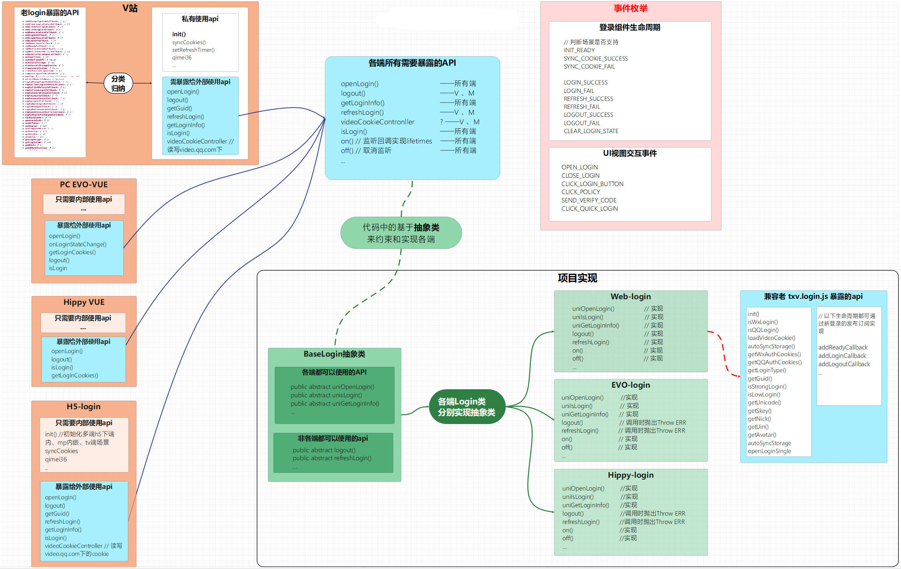

>本文记录重构时的一些要点、感悟、与思考。

# 背景

需要上线手机号验证码登录，老的 tpl + jquery 技术栈实现的登陆组件已经不再好维护迭代了，并且其中还含有大量的回调地狱，代码杂乱。

pc 客户端内嵌的登陆组件和 web 端登录 sdk 逻辑、样式上基本复用（除了登陆成功后注入 cookie 的逻辑不一致），同时 H5 登录、小程序登录、hippy 登录用到的登录登出接口逻辑是可以复用的，考虑到未来可能会把多端登录都收敛到一个 sdk 中，**因此搭建 monorepo** ，便于登陆相关逻辑、登录框 ui 样式、cookie 同步注入逻辑一起复用。详见： [多端登录同一项目](多端登录同一项目（uni）.md)

# 技术方案设计

按 UnionLogin 类、代码目录、各核心功能模块进行拆分讲解

login 架构图



# 从 0 到 1 

## 1. 统计老登陆组件在用的各业务方

首先，我们可以通过鹰眼流水统计 refer 来源，找到是哪些域名和站点在使用登录组件

**那么，如何知道各业务方分别调用了那些登陆组件暴露的方法呢？**

通过调用堆栈的方式来识别，函数执行时，可以主动生成一个错误 `const stackInfo = new Error();` 然后根据 `stackInfo.stack` 得到函数执行堆栈上下文的信息。如下图
	
	
在处理这些堆栈信息，根据正则表达式提取每一行栈的结尾的调用来源, 最后处理得到该堆栈是否是被外侧业务调用。

下面是一层 proxy ，`window.txv.login` 上的每一个对外暴露的方法都包被他进行转发，用于处理堆栈信息。

```js
wrapMethodWithCallerReport: function(loginObj, method, athenaBasisReport) {
        if (typeof method !== "function") {
          return method;
        }
        
        const checkStackLineFromTxv = (lineStr) => {
            const sourceIsTxvCore = lineStr.indexOf("txv.core.js") > -1 || lineStr.indexOf("txv.login.js") > -1;
            return sourceIsTxvCore
        }

        return function () {
          /** 并不是堆栈最终执行的方法名，而是堆栈最先执行的txv.login.xxx 的方法名 */
          let execExposeApiName = method.name;
          const result = method.apply(this, arguments);
          const stackInfo = new Error();
          const stack = stackInfo.stack;

          // 分割调用栈字符串, 倒一下顺序方便后续处理，因为堆栈是先执行的代码在stack底部
          const lines = stack.split("\n").reverse();
          if (!window.__TXV_REPORT_RECORD__) {
            window.__TXV_REPORT_RECORD__ = {};
          }

          // 判断堆栈有调用 txv.login 暴露出的方法
          const firstCallLoginApiPosition = lines.findIndex(function (line) {
            const sourceIsTxvCore = checkStackLineFromTxv(line);
            // 提取函数名
            const funcMatch = line.match(/at\s(?:Object\.)?([a-zA-Z0-9_$]+)\s\(/);
            const funcName = funcMatch ? funcMatch[1] : "";
            const isLoginAPI = typeof loginObj?.[funcName] === "function" && sourceIsTxvCore;
            if (isLoginAPI) {
              execExposeApiName = funcName;
            }
            return isLoginAPI;
          });

          let isOutsideCaller = false;
          let realCallerSource = "";
          if (firstCallLoginApiPosition > -1) {
            for (let i = 0; i < firstCallLoginApiPosition; i++) {
              /**
               * 在首次执行 txv.login 暴露出去的方法之前的堆栈，是否包含txv.core.js路径
               * 包含，说明是 core 自身调用 txv.login.xxx，不是外部业务执行
               */
              const line = lines[i];
              const lineFromTxv = checkStackLineFromTxv(line);
              // core自己通过元素事件（click等）调用了 login.xx， 也算作业务方
              const isSelfCall = line.indexOf("<anonymous>") > -1 && lineFromTxv && i === firstCallLoginApiPosition - 1;
              isOutsideCaller = !lineFromTxv;
              if (isOutsideCaller) {
                if (!realCallerSource) {
                  const match = line.match(/(https?:\/\/[^\s]+)/);
                  realCallerSource = match ? match[1] : "";
                }
              } else {
                break;
              }
            }
            // 上报过了的方法就不再上报了，节省日志内存
            const hasReport = window.__TXV_REPORT_RECORD__?.[execExposeApiName];
            if (isOutsideCaller && !hasReport) {
              // ... 省略上报相关
              athenaBasisReport.info({
                  msgIndex: -9,
                  host: encodeURIComponent(location.host),
                  url: realCallerSource,
                  shortExt5: execExposeApiName,
              });
              window.__TXV_REPORT_RECORD__[execExposeApiName] = true;
            }
          }
          // 返回原始方法的结果
          return result;
        };
    }
```

至此，就可以把所有外侧业务调用的方法和他们的方法名，调用页面都给上报到日志系统，就能过滤出被使用的 api，在新登陆组件中进行兼容。

本质上就是对堆栈信息字符串的处理，<span style="background:#d2cbff">提取出方法名 -> 校验是否是外部 js 调用 -> 增量上报</span>

## 2. svelte 上手，技术选型，为啥用它？

体积小、易于上手，不会把 runtime 运行时打包进产物
## 3. monorepo 搭建、部署流水线搭建

**TODO:** 讲解如何管理大仓，CI/CD 如何发单独的 package 和全部 package 一起发布（本质上是利用 shell 脚本读写目录，再调用 pnpm 进行不同 packages 下每个项目单独 build 后发布）
## 4. 开发 - 踩坑 - 开发
## 5. 编译打包 （rollup、vite 的使用）
## 6. npm 包发布、monorepo 包管理工具
## 7. 推动各业务方升级接入新登录sdk
## 8. 灰度放量方案

>考虑到 txv.core.js 和 txv.login.js 涉及到的业务方较多，历史包袱重，直接对 cdn 链接进行覆盖可能会造成线上问题，且回滚、发布起来比较麻烦。
>
>*因此决定发布新的 cdn 链接，供各业务方增量更新*

#### 8.1 v 站登录组件灰度三阶段  

- 老 txv.core.js 兼容 phone 登录态 cookie 的灰度，确保在部分业务进行新登录组件 sdk 升级后，使用老登陆组件页面能够兼容手机号登录的 cookie。  
  
- 灰度含有新登录组件的老 txv.core.js，关闭手机号登录入口，只含有 QQ、微信登录，保证新登录组件正常登录没问题。  
	频道页、播放页利用 TAB 平台进行灰度放量有新登录组件的老 txv.core。
  
- 推进各业务方更新登录组件 sdk，不开放手机号入口，后续等产品节奏灰度放开手机号能力。
	按照省分灰度手机号入口，接入 TAB 的远程配置开关能力，按地域人群灰。
#### 8.2 注意事项

- 先在频道页、播放页进行灰度分流新老  txv.core.js
- 与业务方约定好回滚策略，改版期间，**maxage 强缓存设短一些**，稳定之后再设长  
- login，core 都是新路径，给各业务增量更新
## 9. 关键流程日志上报、埋点上报

win、mac、web 三端甚至多端如何设计一套通用的日志记录关键事件的发生

**关键：如何一眼就能看出上报的平台（端）、登录类型、发生的行为**。
#### 9.1 流程上报code设计思路 ：

上报 code 统一约束为 6 位数的字符串: 登录平台 + 登录类型 + 拼接符 _ + 三位 action code，代码如下：
```js
/** 用于拼接 msgIndex 上报code时的平台号前缀，区分 web: 0 ，win: 1, mac: 2*/
export const reportPlatformPrefix = {
  [Platform.VSITE]: 1,
  [Platform.WIN]: 2,
  [Platform.MAC]: 3,
};

/** 用于拼接 msgIndex 上报code时的登录类型前缀*/
export const reportLoginTypePrefix = {
  /** 无关登录态的上报 */
  [LoginType.NONE]: 0,
  [LoginType.QQ]: 1,
  [LoginType.WX]: 2,
  [LoginType.PHONE]: 3,
};

/**
 * 100 - 199: 登录流程中的code (登录登出行为、登录登出续期接口、cookie同步、qimei相关)
 * 200 - 299: 中转页的上报code (transfer_login_page登录中转页中一些行为的上报)
 */
export enum LoginFlowCode {
  /** qq 微信登录成功 */
  LOGIN_SUCCESS = 100,
  /** 扫码登录成功后，登录接口有回包，但有除 1120 以外的错误码 */
  LOGIN_FAIL_ERR_RESP = 101,
  /** 扫码登录成功后，中转页抛出的登录type不合法 */
  LOGIN_FAIL_LOGIN_TYPE_ERR = 102,
  
  ...
}
 const msgIndex = `${reportPlatformPrefix[Platform]}${reportLoginTypePrefix[LoginType]}_${LoginFlowCode}`

 example: win端qq上登录成功  msgIndex = `21_010`
 example: web端qq登录失败  msgIndex = `11_010`
 example: mac端点击了关闭按钮  msgIndex = `30_001`
```

# 总结

坑：css 实现，要么严格用 BEF 规范，保证 class 命名不会和业务冲突，要么一开始就用css-mo

