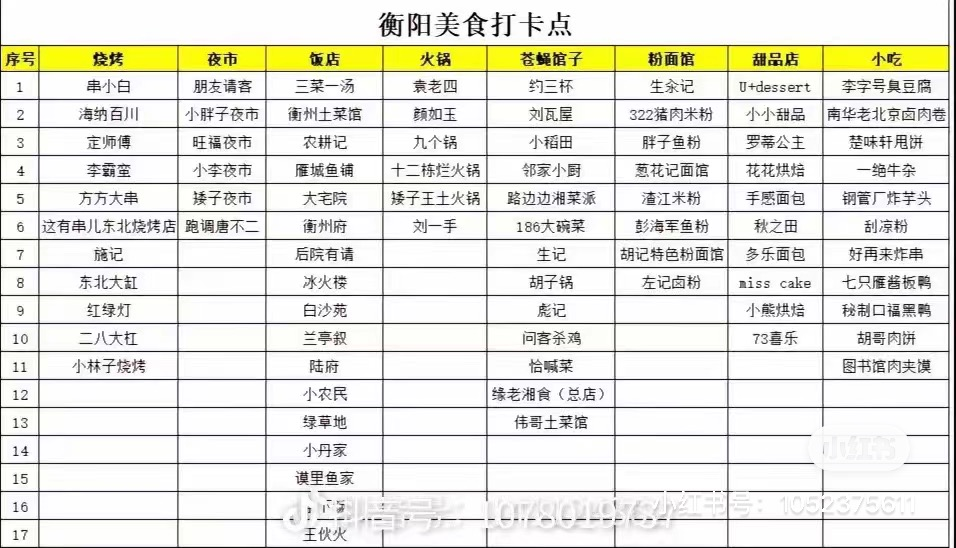

#### 住宿

待定
- 南华大学附近：靠近市中心，xin价比高、热闹！出行比较方便！ 
- 解放路附近：市中心！方便！地理位置好！
- 华新附近：相对于安静、舒适、高品质酒店比较多
  
#### 美食

> 南华大学附近很多好吃的！
> 还有**茶颜悦色**，人不多可以喝喝

#### 行程

##### Day 1

到达酒店，休息 + 吃吃喝喝  —> 衡阳抗战纪念馆 —> 回雁峰 (北门进)  —> 解放路或万达吃喝逛

##### Day 2

石鼓书院  —> 保卫里  —> 东洲岛 —> 晚上：驱车前往衡山景点附近
##### Day 3

> 酒店休息一晚，第二天起来去南岳

🔥**南岳大庙**：棂星门（正门）—> 奎星阁 —> 正南门 —> 御碑亭 —> 嘉应门 —> 御书楼 —> 圣帝殿 —> 圣公圣母殿 —> 财神殿 —> 注生殿 —> 辖神殿 —> 文殊殿 —> 观音殿 —> 寿佛殿 

🔥**祝融峰中心景区爬山**：游客中心（二楼买票三楼坐车上山 —> 南天门（旅游公交车终点站 —> 狮子岩 —> 上封寺  —> 祝融峰（山顶）

